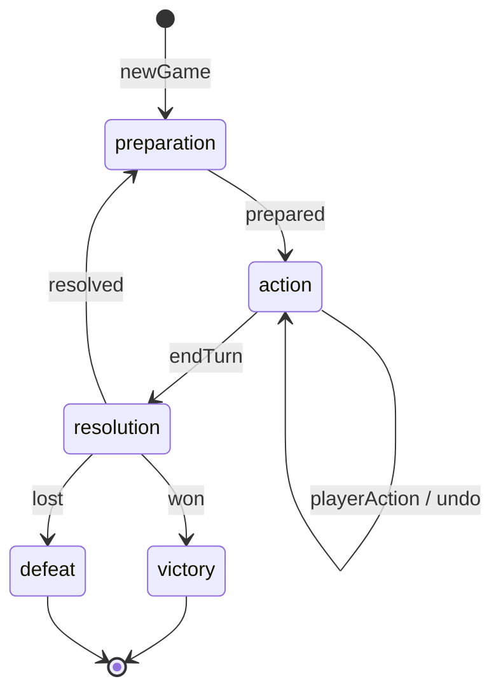
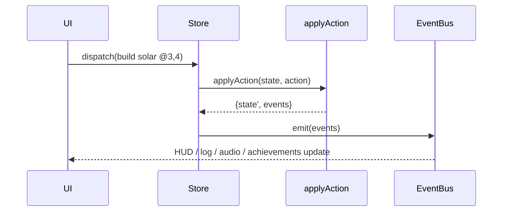

# Terra Revival: Technical Design

> Phase 2 of the SDD flow. Derived from `requirements.md` (ids `R-x.y`).
> This document fixes the architecture, data model, formulas and test
> strategy; code must not invent patterns outside it.

## 1. Stack

| Concern | Choice | Why |
|---|---|---|
| Language | TypeScript 5, `strict` | R-14.4; types catch missing translations (R-12.3). |
| Build / dev server | Vite | Zero-config static build, fast HMR. |
| Rendering | Canvas 2D, `imageSmoothingEnabled = false` | Pixel-perfect sprites (R-11.1) without a heavy engine. |
| UI chrome | Plain DOM + CSS custom properties | Native focus, ARIA, font scaling (R-13.x). |
| Tests | Vitest + fast-check | Unit, property-based (R-14.3) and simulation tests. |

## 2. Module layout

```
src/
  core/                    pure TypeScript, no DOM (R-14.1)
    ecs/world.ts           World, entity lifecycle, component stores, queries
    ecs/components.ts      component types + ComponentMap
    events.ts              GameEvent union + EventBus
    rng.ts                 seeded mulberry32 PRNG with serializable state
    config.ts              all balance constants and definitions
    economy/formulas.ts    pure math functions of §4
    economy/ledger.ts      the only code allowed to change Gold / Energy
    phases.ts              turn state machine (transition table)
    map.ts                 procedural map generation
    state.ts               GameState, createGame, cloneState
    selectors.ts           derived read-only views (ratio, tile info, costs)
    systems/*.ts           ECS systems (§3.3)
    actions.ts             Action union, quote (validation + price), applyAction,
                           runResolution (shared by End turn and the forecast)
    forecast.ts            forecastResolution: the coming resolution on a copy (§3.8)
    advisor.ts             advise: one legal, explained next move (§3.8)
    save.ts                versioned (de)serialization + v1 → v2 migration
    sim/bot.ts             scripted strategies for balance simulation and hints
    grid.ts                coordinates, areas, occupant index
  i18n/                    en.ts (source of keys), uz.ts, ru.ts, translit.ts
                           (Uzbek Latin → Cyrillic), index.ts
  render/                  color (WCAG, hue shift), palette, sprites (incl. pixel
                           digits), renderer, fx (particle simulation + layer)
  ui/                      app (store, dispatch, undo, autosave, views), dom,
                           icons (pixel SVG icon set), settings, theme,
                           achievements, audio, music (generative soundtrack),
                           records, chart, storage
  main.ts                  entry point, service-worker registration (production)
public/                    manifest.webmanifest, sw.js, icons/ (PWA, §7.9)
tests/                     *.test.ts and *.prop.test.ts
```

Dependency rule: `ui`, `render` → `core`; `core` never imports from `ui`,
`render` or `i18n`. Core emits reason codes and event payloads; the UI
translates them.

## 3. Entity-Component-System

### 3.1 World

```ts
type Entity = number;
interface World {
  nextId: Entity;
  alive: Record<Entity, true>;
  c: { [K in ComponentName]: Record<Entity, ComponentMap[K]> };
}
```

- Entities are only ids. Component stores are plain objects keyed by id, so
  the whole world is JSON-serializable and `structuredClone`-able (needed by
  the pure reducer, undo and saves).
- API: `createEntity`, `destroyEntity` (removes from every store), `add`,
  `get`, `has`, `remove`, `query(world, ...names)` returning ids in ascending
  order. Ascending order makes every system deterministic (R-1.1).
- A grid index `tiles: Entity[]` (row-major) maps coordinates to tile
  entities; buildings and flora are separate entities placed on a tile by
  `GridPosition`, looked up through `occupantIndex(world)`.

### 3.2 Components (data only)

| Component | Fields | On |
|---|---|---|
| `GridPosition` | `x, y` | tiles, buildings, flora |
| `Terrain` | `kind: soil \| water \| rock \| ruin \| stack` | tiles |
| `PollutionLevel` | `value: 0..100` | tiles |
| `EcoValue` | `restored: boolean`, `everRestored: boolean` (eco points come from mature flora species) | tiles |
| `Salvage` | `remaining`, `density: 1..3` | ruin tiles |
| `ToxicSource` | `sealed: boolean` | stack tiles |
| `Building` | `type`, `level`, `goldInvested` | buildings |
| `EnergyProducer` | `base` (type key; output from §4.4) | solar, wind, sanctuary |
| `EnergyStorage` | marker (level read from `Building`) | batteries |
| `GoldProducer` | marker | recyclers |
| `Cleanser` | `medium: soil \| water` | scrubber, purifier |
| `EnergyCost` | `upkeep` per turn | scrubber, purifier |
| `ActiveState` | `enabled` (player), `powered` (system) | buildings with upkeep or output |
| `Flora` | `species`, `growth`, `mature: boolean` | plants |
| `Immovable` | marker | sanctuary |

### 3.3 Systems

Each system is a function `(state: GameState, emit: Emit) => void` that
iterates a query and mutates the (already cloned) state. Systems never call
one another; they communicate only through state and emitted events.

| System | Query | Phase | Responsibility |
|---|---|---|---|
| `EconomySystem` | `Building + GoldProducer` | preparation | Credit linear Gold income ⟨I_gold⟩ through the ledger. |
| `EnergySystem` | `Building + EnergyProducer`, `EnergyStorage` | preparation | Recompute E_max, produce energy; upkeep is paid from this pool first, the rest is stored up to the cap (curtailment recorded). |
| `UpkeepSystem` | `EnergyCost + ActiveState` | preparation (inside EnergySystem) | Decide in id order which enabled buildings the pool can power; set `powered`. |
| `RandomEventSystem` | — | preparation | Seeded event roll (§4.9). |
| `CleansingSystem` | `Cleanser + Building + ActiveState + GridPosition` | resolution | Apply ⟨K_clean⟩ within radius. |
| `PollutionSystem` | `ToxicSource + GridPosition` | resolution | Emit ⟨P_emit⟩ from unsealed stacks, clamp. |
| `GrowthSystem` | `Flora + GridPosition` | resolution | Bioremediation, growth, withering, spread (§4.8). |
| `RestorationSystem` | `EcoValue + PollutionLevel + Terrain` | resolution | Recompute `restored`, first-time bounties, milestones. |
| `VictorySystem` | — | resolution | Win / time / collapse checks (R-9). |

Resolution order: Cleansing → Pollution → Growth → Restoration → Victory
(R-6.6), implemented once as `runResolution(ctx)`; End turn and the
forecast (§3.8) both call it. After it, End turn appends a history point
(§3.7). Preparation order: turn++ → Economy → Energy (with Upkeep) →
RandomEvent → refresh `restored` flags (so acid rain shows at once).
A new game starts directly in turn 1's `action` phase: genesis resources stand in for
turn 1's preparation.

### 3.4 Event bus (Event-Driven Architecture)

The reducer returns `GameEvent[]`; `main.ts` publishes them on a typed
`EventBus` (`on(type, fn)`, `onAny(fn)`, `emit(e)`). Subscribers: HUD, event
log + ARIA live region, audio, achievements, camera shake, tutorial. Core
never references a subscriber (R-11.3).

Event types (discriminated union on `type`):
`phase:changed`, `turn:started`, `gold:changed`, `energy:changed`,
`building:placed`, `building:upgraded`, `building:demolished`,
`building:toggled`, `building:unpowered`, `tile:salvaged`, `tile:cleaned`,
`flora:planted`, `flora:matured`, `flora:withered`, `flora:spread`,
`tile:restored`, `ecosystem:milestone` (= `EV_ECOSYSTEM_RESTORED`),
`stack:sealed`, `event:random`, `action:rejected`, `game:won`, `game:lost`,
and, for the resolution waves of R-11.17, `building:pulsed {building,
x, y, radius}` (every working cleanser, emitted by CleansingSystem) and
`stack:emitted {x, y, radius}` (every unsealed stack, PollutionSystem).
`event:random` carries `tiles` — the tiles acid rain hit (empty otherwise).

### 3.5 Turn state machine (R-1.2)



`transition(phase, trigger)` is a total lookup table; an unlisted pair returns
`null` and the reducer rejects with `wrong_phase` (R-1.6, R-1.7).

### 3.6 Reducer contract (R-14.2)

```ts
applyAction(state: GameState, action: Action): { state: GameState; events: GameEvent[] }
```

1. If `action.txId` is in `state.processedTx` → return the *same* state, no events (R-3.9).
2. Validate (phase, bounds, terrain, occupancy, costs). On failure → same state + one `action:rejected {reason}`.
3. `next = cloneState(state)`; apply the effect; debit via ledger; record `txId`.
4. `endTurn` additionally runs resolution then preparation systems.

Actions: `salvage`, `build {building}`, `upgrade`, `demolish`, `toggle`,
`plant {species}`, `cleanup`, `endTurn`. All but `endTurn` carry `{x, y}`.
Undo (R-1.8) is a UI-side stack of prior `GameState`s cleared on `endTurn`.



### 3.7 GameState

```ts
interface GameState {
  version: 2; seed: number; difficulty: 'gentle'|'balanced'|'hard';
  width: number; height: number; turn: number; phase: Phase;
  world: World; tiles: Entity[];
  gold:   { balance; earned; spent };
  energy: { current; produced; consumed; curtailed; max };
  rng: number;                // PRNG state
  processedTx: string[];      // idempotency
  milestonesReached: number;  // 0..4
  collapseStreak: number;
  startPollution: number;     // average pollution at genesis (collapse baseline)
  outcome: null | { result: 'victory'|'defeat'; reason: string };
  stats: { salvaged; planted; built; withered; spread; restoredEver; bountyPaid; milestoneGold; sealed };
  journal: string[];          // milestone keys
  history: { turn; ratio; pollution }[]; // R-10.5: turn 0, then one point per resolution
}
```

`history[i].turn` is `i`: a point for genesis (turn 0) and one appended after
every resolution, with `ratio` rounded to 3 and `pollution` to 1 decimal so
saves stay small. A version-1 save is migrated on load by adding a
one-point history for the last resolved turn (R-10.6); anything else that
is not version 2 is rejected (R-10.3).

### 3.8 Forecast and advisor (R-13.13, R-13.14, R-14.8)

```ts
forecastResolution(s): null | {
  withered: { x, y, species }[];  matured: { x, y, species }[];
  pollution: number[];            // every tile after the resolution, row-major
  ratio; averagePollution;        // after the resolution
  outcome: Outcome | null;        // victory / defeat this turn
}
```

It returns `null` outside the `action` phase. Otherwise it clones the state
and runs `runResolution` on the clone with a private event sink and a copy
of the PRNG state, then reads the answer from the clone and the events. The
live state, its PRNG and its event stream are never touched, and because the
code path is the one End turn runs, the forecast is exact — including
withering after bioremediation — rather than an approximation. The coming
preparation (and so the next random event) is deliberately not forecast.

```ts
advise(s, forecast): null | { id, intent: Intent | null, at: {x, y} | null, params }
```

Priority: (1) `witherRisk` — the first plant in `forecast.withered`, with a
manual cleanup of its tile as the move when that is legal; (2) `noEnergy`
— Energy is 0, so end the turn; (3) the greedy bot's next intent
(`greedyIntent`, the strategy that wins every balance seed, R-9.5),
translated by kind: `seal`, `energy` (solar / wind), `battery`, `recycler`,
`scrubber`, `purifier`, `salvage`, `plant`, `cleanup`, `upgrade`,
`relocate` (demolish a scrubber whose area is clean); (4) `endTurn`. The
UI turns `id` + `params` into a sentence; `intent` feeds "Show me".

## 4. Economy formulas

All results are integers. `⌈⌉` ceiling, `⌊⌋` floor, `round` = half away from
zero. Symbols match the `⟨…⟩` references in requirements.

### 4.1 Linear income (R-3.3) — ⟨I_gold⟩

    I_gold = G_base + k_rec · Σ L_r          G_base = 2, k_rec = 4

`Σ L_r` = total level of *all* Recyclers. Each Recycler level adds exactly
4 Gold per turn, forever: predictable, steady growth.

### 4.2 Linear salvage yield (R-4.1) — ⟨G_salvage⟩, ⟨E_salvage⟩

    G_salvage(d) = k_salv · d                 k_salv = 5,  d ∈ {1,2,3}
    E_salvage = 1

Ruins hold `remaining ∈ [2,4]` scrap. Expected yield of one ruin with uniform
`d` and `remaining`: `E = 5 · 2 · 3 = 30` Gold for 3 Energy.

### 4.3 Exponential costs (R-5.1, R-5.4) — ⟨C_build⟩, ⟨C_upgrade⟩

    C(type, L) = ⌈ a_type · b^(L−1) ⌉         b = 1.75, L = target level (1..L_max)
    C_build = C(type, 1) = a_type,  C_upgrade(L→L+1) = C(type, L+1)
    E_build = 2,  E_upgrade = 1

| Type | a | L_max | Level 1 | Level 2 | Level 3 | Placement | Effect |
|---|---|---|---|---|---|---|---|
| Solar Panel | 14 | 3 | 14 | 25 | 43 | soil | energy `L + 1` |
| Wind Turbine | 24 | 3 | 24 | 42 | 74 | rock | energy `2L + 1` |
| Soil Scrubber | 18 | 3 | 18 | 32 | 56 | soil | cleans soil ⟨K_clean⟩, upkeep 1 |
| Water Purifier | 22 | 3 | 22 | 39 | 68 | water | cleans water ⟨K_water⟩, upkeep 1 |
| Recycler | 28 | 3 | 28 | 49 | 86 | soil | +4 Gold · L per turn |
| Battery | 20 | 3 | 20 | 35 | 62 | soil | raises ⟨E_max⟩ |
| Stack Sealer | 45 | 1 | 45 | — | — | unsealed stack | seals the stack |

Demolish refund: `⌊goldInvested / 2⌋` (credited as earned).

### 4.4 Energy production

    E_prod = R_base + Σ_{powered producers} out(type, L)
    R_base = 3 (the Sanctuary),  out(solar, L) = L + 1,  out(wind, L) = 2L + 1

### 4.5 Logarithmic energy cap (R-3.5) — ⟨E_max⟩

    E_max(B) = ⌊ α · ln(1 + B) + β ⌋          α = 6, β = 8, B = Σ battery levels

| B | 0 | 1 | 2 | 3 | 5 | 9 |
|---|---|---|---|---|---|---|
| E_max | 8 | 12 | 14 | 16 | 18 | 21 |

`ln(1+B)` replaces `ln(x)` so `B = 0` is defined; diminishing returns keep
late-game actions scarce.

Upkeep is drawn from the pool `current + E_prod` first (in entity-id order; a
building that does not fit sleeps this turn), then the rest is clamped:

    upkeep = Σ upkeep of buildings the pool can power
    added  = min(E_prod, E_max + upkeep − current)
    current ← current + added − upkeep           (≤ E_max)
    produced += added;  consumed += upkeep;  curtailed += E_prod − added

so Invariant 1 holds exactly and curtailed energy never counts as produced.

### 4.6 Logarithmic cleansing (R-6.3) — ⟨K_clean⟩, ⟨K_water⟩

    K_clean(L) = round(8 · ln(1 + L) + 6)     → 12, 15, 17
    K_water(L) = round(12 · ln(1 + L) + 10)   → 18, 23, 27
    radius(scrubber, L) = L ≥ 3 ? 2 : 1,  radius(purifier) = 1
    own tile: K,  other tiles in radius (Chebyshev): ⌊K / 2⌋

Scrubbers clean any terrain in range; purifiers apply full power only to
water tiles and half power to land tiles in range.

Manual cleanup: `E_cleanup = 2`, `K_manual = 10`, Gold cost 0 (R-3.12).

### 4.7 Pollution emission (R-6.2) — ⟨P_emit⟩

    P_emit(d) = [6, 3, 1] for Chebyshev distance d = 1, 2, 3 (0 beyond)

Applied by each unsealed stack each resolution, then `clamp(0, 100)`.

### 4.8 Flora

| Species | Gold | Energy | Tolerance (plant ≤) | Withers (>) | Maturation | Bioremediation | Eco |
|---|---|---|---|---|---|---|---|
| Grass | 3 | 1 | 40 | 60 | 2 | 1 | 1 |
| Shrub | 6 | 1 | 25 | 45 | 3 | 2 | 2 |
| Tree | 12 | 1 | 10 | 30 | 5 | 3 | 4 |

Growth per resolution: `+2` if orthogonally adjacent to a clean water tile,
else `+1`. Mature plants clean their own tile by the bioremediation value.

**S-curve spread (R-7.5) — ⟨p_spread⟩.** For each mature grass or shrub, pick
one random orthogonal neighbour; if it is empty `soil` with pollution ≤ 20 it
receives a grass seedling with probability

    p_spread(r) = L / (1 + e^(−k (r − r0)))   L = 0.35, k = 10, r0 = 0.35

where `r` is the restoration ratio. Slow start, fast middle, plateau.

### 4.9 Rewards and random events

    G_restore = 2                             first time a tile becomes restored
    G_milestone(i) = 20 · i                   i = 1..4 at r ≥ 0.10, 0.25, 0.50, 0.75

Random event (from turn 3): with probability `p_evt = 0.30` pick by weight:

| Event | Weight | Effect | Gold EV contribution |
|---|---|---|---|
| Acid Rain | 0.30 | +10 pollution to 5 random restorable tiles | 0 |
| Scrap Caravan | 0.25 | +12 Gold | 0.30 · 0.25 · 12 = 0.90 |
| Pollinators | 0.25 | +1 growth to every immature plant | 0 |
| Sunny Day | 0.20 | +3 Energy (capped) | Energy EV 0.30 · 0.20 · 3 = 0.18 |

Expected value `E(x) = Σ x_i p_i` = **0.90 Gold** and **≤ 0.18 Energy** per
turn — small next to base income, so luck flavours but never decides a game.

### 4.10 Difficulty

| | Gentle | Balanced | Hard |
|---|---|---|---|
| Start Gold | 60 | 40 | 30 |
| Stacks | 2 | 3 | 4 |
| Win ratio | 0.55 | 0.65 | 0.70 |
| Turn limit | none | 60 | 55 |
| Collapse margin (avg ≥ start avg + m for 3 turns) | off | m = 12 | m = 10 |

Start Energy = `E_max(0)` = 8 (recorded as produced). Start Gold is recorded
as earned. Harmony score:
`10 · restored + Σ eco(mature flora) + 2 · max(0, 100 − turn)`.

### 4.11 Macro balance (GEEvo-inspired simulation)

`sim/bot.ts` plays with a greedy heuristic (salvage while ruins remain, seal
nearest stack when affordable, scrubbers on the most polluted clusters,
solar when energy-starved, plant the best species a tile tolerates). The
simulation test (R-9.5) runs it on fixed seeds and asserts it wins
*balanced* with at least 10 turns to spare, also wins Gentle and Hard, while a
passive bot (only ends turns) does not win and never loses on Gentle. Any
constant change must keep this test green.

Tuning record (20 seeds each, greedy bot): Gentle wins in 29–38 turns,
Balanced in 33–43 (limit 60), Hard in 38–48 (limit 55). A passive player on
Balanced collapses between turns 17 and 50 or runs out of time; on Hard it
collapses by turn ~10. Two changes came out of tuning: β raised from 6 to 8,
and upkeep paid from production before the cap (otherwise the cap starved
scrubbers and the bot stalled at ~20 % restored).

## 5. Error handling

- Core never throws for player input; every invalid input maps to a reason
  code: `wrong_phase`, `out_of_bounds`, `invalid_target`, `invalid_terrain`,
  `occupied`, `no_building`, `max_level`, `immovable`, `not_toggleable`,
  `insufficient_gold`, `insufficient_energy`, `too_polluted`, `game_over`.
- Ledger debits assert `amount ≤ balance`; a violated assertion is a
  programming error and throws (caught by property tests, never by players).
- Saves are versioned JSON with a shape check; failures return `null`.
  Every `localStorage` access is wrapped in `try/catch` (R-10.3).

## 6. Property-Based Testing strategy (fast-check)

Generators (`tests/arbitraries.ts`):

- `arbSeed` — 32-bit integers; `arbDifficulty` — the three presets.
- `arbAction(w, h)` — weighted `oneof` over every action kind, with in- and
  out-of-bounds coordinates, every building and species, and `endTurn`.
- `arbTxId` — drawn from a *small* pool so duplicates are frequent.
- `arbScript` — arrays of 1–200 actions; replays interleave `endTurn`, so
  random events, emissions and growth run between actions.

Invariants (checked after **every** step of every script):

1. **Energy conservation.** `energy.consumed + energy.current = energy.produced` in every cycle (curtailed energy never enters `produced`).
2. **Gold conservation.** `gold.spent + gold.balance = gold.earned`.
3. **Non-negativity.** `gold.balance ≥ 0` and `energy.current ≥ 0` for any interleaving of actions and random events ("parallel" events are serialized by the reducer, so every interleaving is a sequence fast-check can generate).
4. **Capacity.** `0 ≤ energy.current ≤ energy.max`.
5. **Idempotency.** Applying the same action twice equals applying it once: `apply(apply(s, a), a) ≡ apply(s, a)` (deep equality), and a repeated `txId` emits no events.
6. **Purity.** `applyAction` never mutates its input (deep-frozen input does not throw, deep-equal before/after).
7. **Rejection is a no-op.** A rejected action returns a state deep-equal to its input except nothing, and emits exactly one `action:rejected`.
8. **Bounds.** Every tile pollution is an integer in [0, 100]; building levels in [1, L_max]; restoration ratio in [0, 1].
9. **Determinism.** The same seed and action script yields deep-equal states.
10. **Save round trip.** `load(save(s)) ≡ s` for any reachable state.
11. **Restoration bounty once.** Total restoration bounty paid ≤ 2 · restorable tiles; milestone Gold ≤ 20·(1+2+3+4).
12. **Phase machine.** After any script the phase is `action`, `victory` or `defeat`; actions in terminal states are rejected.
13. **Forecast is exact.** For any reachable `action`-phase state, the forecast's withered and matured plants equal the `flora:withered` / `flora:matured` events the real End turn emits before the next preparation, its pollution array equals the tiles' pollution right after the real resolution, and its outcome equals the real outcome; forecasting never mutates the state.
14. **Hints are legal.** For any reachable `action`-phase state, `advise` returns advice whose move, if any, `quote` accepts.
15. **History.** `history.map(p => p.turn)` is `0, 1, …, n` where `n` is the number of resolutions so far; every ratio is in [0, 1] and every pollution in [0, 100].

Formula properties (`formulas.prop.test.ts`): `I_gold` is linear
(`I(a+b) − I(0) = (I(a) − I(0)) + (I(b) − I(0))`); `C(type, L+1) ≥ C(type, L)`
and `C(L+1)/C(L) → b`; `E_max` is non-decreasing with non-increasing
increments (concavity); `K_clean` monotone and concave; `p_spread` is in
(0, L) and monotone.

Shrinking: fast-check shrinks failing scripts to minimal action sequences;
failures print the seed and path for replay (`fc.assert(..., { seed, path })`).

Other test layers: unit tests for ECS queries and the transition table,
a contrast test over theme tokens (R-13.1), an i18n completeness test
(R-12.3, backed by the type check), the macro-balance simulation (R-9.5),
and presentation tests for the pure parts of the UI: particle budget,
expiry, opacity bounds and ambient sources (`fx.test.ts`), icon maps and
their SVG paths (`icons.test.ts`), sprite maps, palette groups, placement
previews and `allTileInfo ≡ tileInfo` (`polish.test.ts`), the forecast and
the advisor (`forecast.prop.test.ts`, `advisor.test.ts`: Invariants 13, 14),
history and save migration (`history.test.ts`: Invariant 15), world stage,
growth stages and records (`stage.test.ts`), music data (`music.test.ts`),
charts (`chart.test.ts`) and transliteration (`translit.test.ts`).

## 7. Rendering and UI

- Tile size 16 px source, drawn at an integer zoom that fits the viewport.
- Sprites are small character maps (`'..aab..'`) rasterised once per palette
  into offscreen canvases. Shadows are hue-shifted toward blue/violet,
  highlights toward yellow/orange (R-11.1).
- Palette = interpolation between three keyframes by *progress*
  `p = min(1, ratio / winRatio)`: 0 → Chrome, 0.45 → Autumn, 0.9+ → Spring
  (R-11.2). The same thresholds define the world stage (`worldStage(p)`:
  collapse / transition / revival) used by announcements and music, so on
  every difficulty the valley is in full Spring when the game is won.
- Pollution bands draw hatch overlays: toxic = cross-hatch + hazard glyph,
  polluted = diagonal lines, recovering = dots, clean = none (R-13.2).
  Unpowered buildings show a "zZ" glyph; disabled ones a pause glyph.
- DOM HUD with CSS variables for two themes (default, high contrast); root
  font size is multiplied by the UI scale setting (R-13.3).
- Input: pointer (click / tap), keyboard map `{ up, down, left, right,
  activate, endTurn, undo, tool1..tool9, cancel }`, remappable with
  conflict detection (R-13.5).
- Audio: WebAudio oscillators (no asset files), subscribed to the bus.

### 7.1 Particle layer (R-11.7, R-14.5)

A second canvas (`canvas.fx`, `pointer-events: none`) sits exactly over the map
canvas with the same pixel size. `render/fx.ts` splits it in two:

- `FxSim` — pure and DOM-free, so it is unit-tested. Particles live in tile
  units: `{ kind, x, y, vx, vy, age, life, size, color, phase }`.
  `step(dt)` clamps `dt` to 0.1 s, integrates, drops expired particles and
  trickles ambient particles in (at most `⌈8·dt⌉` per step, so a loaded map
  never "pops").
- `FxLayer` — paints the simulation snapped to the art-pixel grid
  (1 art pixel = tile / 16), at most 30 fps, and stops its animation frame as
  soon as nothing moves or its canvas leaves the document.

| Kind | Source | Motion | Life |
|---|---|---|---|
| pollen | restored tiles, target `min(36, ⌊restored / 3⌋)` | slow drift with sine sway | 4–8 s |
| smog | each unsealed stack, one puff per 0.26 s, ≤ 8 per stack | rises, slows, grows 1→3 px | 1.8–2.8 s |
| spark / leaf / drop | bus events (salvage, build, seal / plant, mature, spread, restore / cleanup) | radial burst under gravity | 0.5–1.4 s |
| petal | `ecosystem:milestone` (45), `game:won` (160) | falls with sway across the map | 4–7 s |
| butterfly | mature shrubs and trees, target `min(10, ⌊blossoms / 2⌋)`; 14 crossing the map for `pollinators` | flutters within ±0.9 × ±0.5 tiles of its home, wings flap every 0.12 s (3 × 2 px) | 6–10 s |
| bird | progress ≥ 0.25: a flock of 1–3 every 8–16 s | crosses the top 60 % of the map at 1.4–2 tiles/s, wings flap every 0.2 s (5 × 3 px) | until off-map |
| glint | clean water tiles, target `min(6, ⌊tiles / 4⌋)` | twinkles in place (1 px) | 0.5–1.1 s |
| rain | `event:random` acid rain: 90 streaks spread over 1.2 s, `acid` splashes on the hit tiles, violet tint 0.25 for 2.4 s | falls at 10 tiles/s, slanted (1 × 3 px) | until off-map |
| mote | `event:random` sunny: 40 golden motes, warm tint 0.16 for 2.4 s | rises slowly | 2–3.2 s |

Resolution waves (R-11.17) are a separate list of at most 40 pulses:
`{ kind: 'clean' | 'emit', x, y, radius, age, life = 0.7 s }`, created from
`building:pulsed` (at once) and `stack:emitted` (0.35 s later, by starting
`age` at −0.35). A pulse is a square outline — the Chebyshev area the
mechanic really covers — growing from the tile to `radius + ½` tiles and
fading out; `clean` is a solid cyan line, `emit` a dashed red one, so the
two differ in shape as well as color. A single tint slot (color, alpha,
life) fades in over 0.2 s and out over the second half of its life.

Budget: at most `FX_MAX = 300` particles; further spawns are dropped.
Opacity is `min(age / 0.25, (life − age) / (0.35 · life))`, clamped to [0, 1].
Ambient sources come from `sourcesFromState(state)` (the `EcoValue.restored`
flags and unsealed `ToxicSource`s) after every state change. With reduced
motion on, the layer is disabled: no particles, no frames, an empty canvas.

### 7.2 Icon set and previews (R-11.8, R-13.9, R-13.10)

- `ui/icons.ts` holds 8–9 px character maps (`'#'` = ink). `iconPath` turns
  every horizontal run into one SVG sub-path, painted with `currentColor` and
  `shape-rendering: crispEdges`, so icons inherit contrast-checked text colors
  and never depend on emoji or symbol fonts.
- The renderer receives `ghost: { sprite, ok }` for the selected tool on the
  cursor tile: `previewSprite(tool)` (building, or the species seedling) is
  drawn at 60 % opacity only when `quote(...).ok`; a 7 × 7 badge is always
  drawn in the tile's lower-left corner (check = allowed, cross = rejected).
- `allTileInfo(state)` computes every tile's view with one occupant index, so a
  full map redraw costs one pass over the entities instead of one per tile.
- Tutorial tips are docked at the top of the side column; toasts rise from
  the bottom-right corner. The palette is grouped by `toolGroup(tool)`
  (`restore`, `plant`, `build`, `manage`).


### 7.3 Lenses (R-13.12)

`lens: 'normal' | 'pollution' | 'restoration'` is UI state (not saved),
cycled by the lens control or the `lens` key (default L). The renderer draws
the overlay after tiles and before the cursor:

- **Pollution**: every restorable tile with pollution > 0 gets its value in a
  3 × 5 pixel-digit font (`DIGITS` in `sprites.ts`, 1 px spacing, up to three
  digits = 11 px) centred on a 13 × 7 px dark backing (`rgba(12,14,20,0.82)`,
  text `#ffffff` — contrast far above 4.5 : 1 on any tile). Every unsealed
  stack shows its reach as a dashed outline of its Chebyshev-3 area.
- **Restoration**: on restorable tiles — restored → check badge; clean soil
  with nothing on it → sprout mark ("plant here"); a growing plant on clean
  soil → the turns until it matures in the digit font; polluted → cross
  badge (clean it first). Rock and stack tiles are dimmed (`rgba(0,0,0,0.45)`)
  because they never count.

`TileInfo.flora` carries `stage` and `turnsLeft = ⌈(maturation − growth) / g⌉`
where `g` is 2 next to clean water, else 1 (R-7.3).

### 7.4 Living world (R-11.13 – R-11.17, R-13.14)

- Growth stages: `floraStage` = `seedling` while `growth < maturation / 3`,
  `young` until mature, then `mature`; sprites `<species>0`, `<species>1`,
  `<species>`.
- Banks: for each orthogonal pair of water / non-water tiles the water side
  gets a 1 px foam line (`shade(water, +0.35)`) and the land side a 1 px wet
  line (`shade(land, −0.3)`), both hue-shifted like all shading.
- Forecast marks: a 7 × 7 warning-triangle sprite (`risk`) in the top-left
  corner of every plant in `forecast.withered`, blinking every 0.5 s unless
  reduced motion is on; the hint target gets a dashed focus-color outline
  whose dashes march (static with reduced motion).
- HUD: the progress bar shows a hatched segment from the current to the
  forecast ratio; End turn shows `warn + n` when n plants will wither, a
  star when `forecast.outcome` is a victory, and a "last turn" chip when
  `turn = turnLimit`. The inspector adds "after this turn: v" (with an up or
  down arrow) and, for a doomed plant, "will wither: pollution v > limit".

### 7.5 Turn report and stage banner (R-11.12, R-11.19)

When End turn succeeds and the game goes on, the store compares the state
before and after: `Δgold`, `Δenergy`, `Δrestored %` and `Δaverage pollution`
(both rounded before subtracting) appear as chips beside the values — an
up / down arrow icon plus color, where "good" means more Gold, Energy and
restoration but *less* pollution — for 6 s or until the next action. If
`worldStage(progress)` differs before and after, a banner with the stage
name and one line of flavour text crosses the map (fades only, 2.8 s; static
for 2.8 s with reduced motion), a chronicle entry is added and the live
region announces it.

### 7.6 Music (R-11.18)

`ui/music.ts` shares the audio context of `ui/audio.ts` and never touches
game state: the store calls `music.setMood(worldStage(progress))` (title
screen: `transition`; victory: `revival`). Pure data, unit-tested:

| Mood | Chords (MIDI, one every) | Low-pass | Bell notes (chance per 0.5 s) |
|---|---|---|---|
| collapse | Am, F, Dm, Em voicings from A2 (8 s) | 700 Hz | A-minor pentatonic (0.10) |
| transition | Dsus2, C, Am7, G6 (7 s) | 1300 Hz | D-dorian pentatonic (0.22) |
| revival | Cmaj9, Fmaj7, Am7, G6 (6 s) | 2400 Hz | C-major pentatonic (0.34) |

Pads are two detuned oscillators per chord note (triangle + sine) with a
1.6 s attack and 2.4 s release; bells are sine plucks with a 1.4 s decay
into a feedback delay (0.33 s, feedback 0.3). The music bus sits at gain
0.07, crossfades 3 s when the mood changes, and the context is suspended
while `document.hidden`. A 250 ms scheduler looks one second ahead on the
audio clock, so timing does not depend on the frame rate.

### 7.7 Charts and records (R-10.7, R-11.20)

`ui/chart.ts` turns `history` into an inline SVG (viewBox 320 × 150, 28 px
left / 22 px bottom margins): restoration % as a solid line with round
joints, average pollution as a dashed line, the goal as a dotted line, all
on 0–100 % with the turn axis 0…n. `chartModel(history, winRatio)` returns
the path data and a text summary (`role="img"` + `aria-label`); it is pure
and unit-tested. With fewer than two points the chart says it needs another
turn. `ui/records.ts` keeps `{ played, wins, bestScore, fewestTurns }` per
difficulty in `localStorage` (`terra-revival:records`), parsed defensively;
`recordGame` returns which records a finished game beat.

### 7.8 Localization pipeline (R-12.1 – R-12.5)

`Lang = 'en' | 'uz' | 'uz-Cyrl' | 'ru'`. `en.ts` defines the keys; `uz.ts`
and `ru.ts` are typed `Record<TranslationKey, string>`, so a missing key
fails the type check. `uz-Cyrl` is `translit(uz)`: a longest-match rule
table over lower/upper case — `o'`/`g'` (with `'`, `ʻ`, `‘` or `’`) → `ў`/`ғ`,
`sh ch` → `ш ч`, `yo yu ya ye` → `ё ю я е` (except `yo'` → `йў`), `e` → `э`
at the start of a word, `ts` + `iya` → `ция`, then single letters, and a
remaining apostrophe → `ъ`. Protected spans are copied as they are:
`{placeholders}`, the brand *Terra Revival*, key names (`Enter`, `Esc`, a
lone capital letter such as `E` or `Z`), and anything already in Cyrillic.
Russian strings avoid number agreement by putting counts after a colon or
dash ("Ходов: {turns}"). The first language comes from `navigator.language`.

### 7.9 Progressive Web App (R-14.7)

`public/manifest.webmanifest` (name, short name, `display: standalone`,
`start_url: "./"`, theme `#0f1418`) lists 192 px, 512 px and a maskable
512 px icon rendered from the pixel sprites. `public/sw.js`:

- install: pre-cache `./`, `index.html`, the manifest and icons; activate:
  delete caches of older versions, claim clients;
- navigations: network first, fall back to the cached page when offline;
- other same-origin GET requests: cache first, then network (and store the
  response), keeping at most 60 entries;

`main.ts` registers `./sw.js` only when `import.meta.env.PROD` and the
browser supports service workers, so the Vite dev server is unaffected.
Relative URLs keep it working under the GitHub Pages sub-path.
