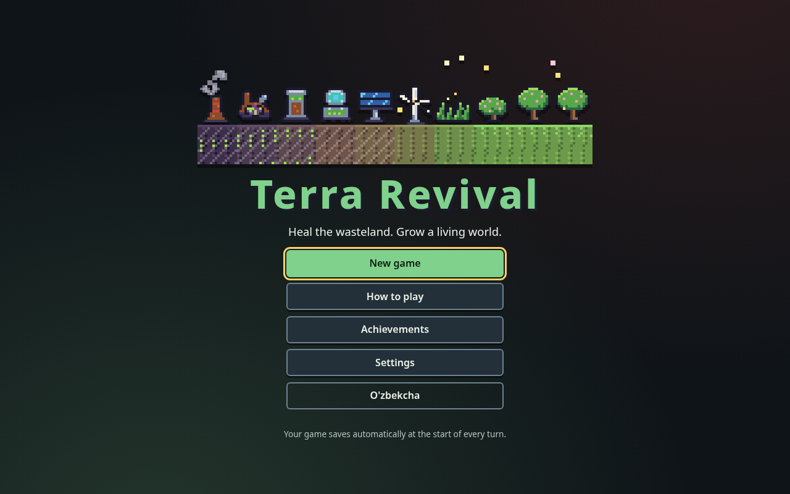
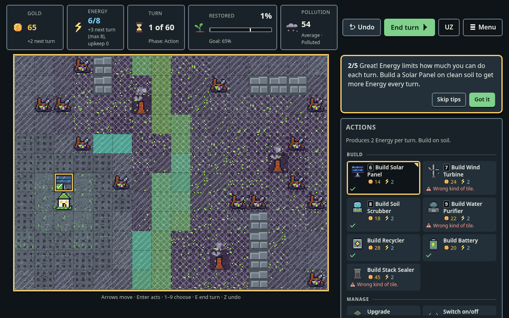
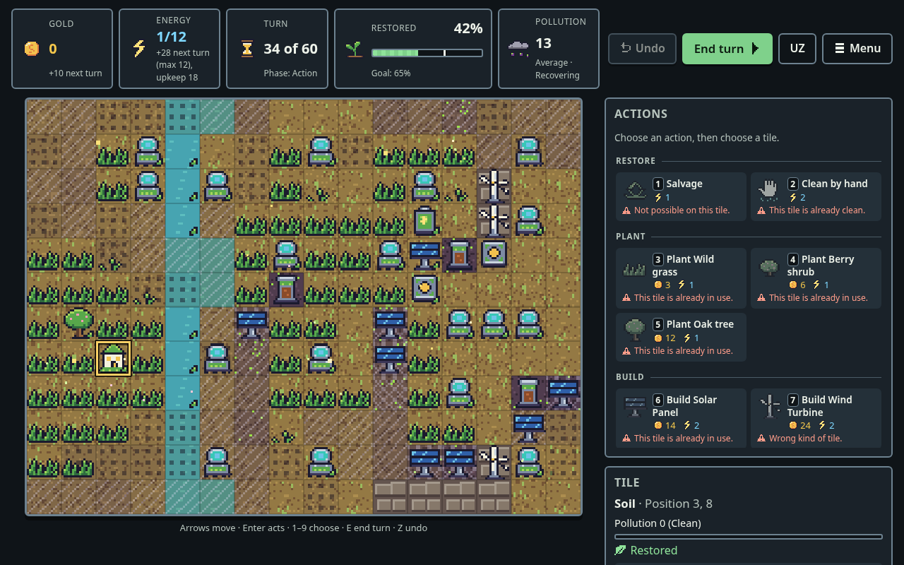
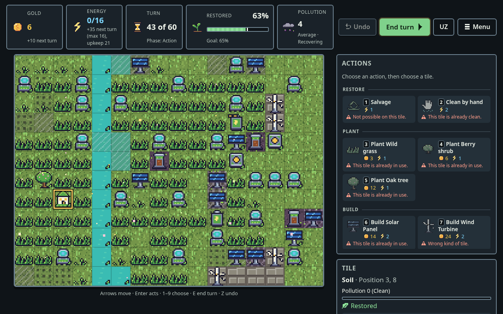

# Terra Revival

**English** · [O'zbekcha](#terra-revival-ozbekcha)

[](https://github.com/Hoffenuz/strategiya/actions/workflows/ci.yml)

A calm, turn-based 2D pixel-art strategy game about healing, not conquest.
You are the Guardian of the last Sanctuary in a valley poisoned by a dead
industry. Salvage toxic ruins for **Gold**, spend **Energy** to build clean
infrastructure, seal the smoking stacks, cleanse soil and water, and plant
life back into the land. The world's colors move from *Cyberpunk Chrome*
through *Autumn Harvest* to *Spring Blossom* as it heals.

| | |
|---|---|
|  |  |
|  |  |

Playable in **English** and **Uzbek**, with keyboard-only controls,
high contrast, UI scaling up to 200 %, reduced motion and colour-blind-safe
patterns and icons.

## Play

```bash
npm install
npm run dev        # http://localhost:5173
```

`npm run build` writes a static site to `dist/` that works from any folder.
The `Deploy to GitHub Pages` workflow publishes `main` to
`https://hoffenuz.github.io/strategiya/` once Pages is switched on
(Settings → Pages → Source: **GitHub Actions**).

### How to play

| | |
|---|---|
| **Goal** | Restore the share of land shown in the top bar (55 % Gentle, 65 % Balanced, 70 % Hard). A soil tile is restored when its pollution is 0 and it holds a grown plant or a building; clean water counts too. |
| **Turn** | Preparation (income, energy, events) → Action (you play) → Resolution (cleansing, pollution, growth). |
| **Gold** | Salvage ruins, build Recyclers, earn a bounty for every restored tile and each milestone. |
| **Energy** | Every action costs Energy. It refills each turn from the Sanctuary, Solar Panels and Wind Turbines, up to a capacity that Batteries raise (with diminishing returns). |
| **Pollution** | Unsealed stacks spread pollution every turn. Seal them (45 Gold), then clean with Soil Scrubbers, Water Purifiers, plants or by hand. |
| **Difficulty** | Gentle has no way to lose. Balanced and Hard have a turn limit and can collapse if pollution rises well above where it started. |

Pick an action in the palette (grouped into Restore, Plant, Build and Manage),
then a tile. The tile under the cursor previews the result: a translucent
building or seedling with a green check where the action is allowed, a red
cross where it is not, and the reason next to the action.

**Keyboard:** arrows move, `1`–`9` choose an action, `[` `]` cycle actions,
`Enter` acts, `E` ends the turn, `Z` undoes, `Esc` deselects or opens the menu.
Every key can be remapped in Settings.

### Accessibility

- Text contrast ≥ 4.5 : 1 and large elements ≥ 3 : 1 in both themes, checked by a test.
- Color is never the only signal: pollution bands have hatch patterns, states and reasons have pixel icons *and* text, previews use a check or a cross.
- Every icon is drawn by the game itself, so nothing depends on emoji or symbol fonts.
- UI scale 100–200 % without horizontal scrolling, a high-contrast theme, remappable keys, full keyboard play, screen-reader announcements.
- Reduced motion (follows the OS setting) removes screen shake, particles and all other non-essential animation.

## Engineering

The project follows Spec-Driven Development with Kiro. The spec lives in
[`.kiro/specs/terra-revival/`](.kiro/specs/terra-revival):

- [`requirements.md`](.kiro/specs/terra-revival/requirements.md): EARS requirements (R-x.y).
- [`design.md`](.kiro/specs/terra-revival/design.md): ECS architecture, event bus, turn state machine, exact economy formulas, the property-based test strategy, rendering and the particle layer.
- [`tasks.md`](.kiro/specs/terra-revival/tasks.md): dependency-ordered, TDD-first tasks in parallel waves.

[`.kiro/steering/`](.kiro/steering) holds the project rules Kiro applies to every change.

Highlights:

- `src/core` is pure TypeScript (no DOM): an Entity-Component-System world, isolated systems, and one pure reducer `applyAction(state, action) → { state, events }`. Every Gold and Energy change goes through one ledger.
- Economy curves: linear income `I = 2 + 4·ΣL`, exponential costs `⌈a·1.75^(L−1)⌉`, logarithmic energy cap `⌊6·ln(1+B) + 8⌋`, logistic flora spread.
- The HUD, chronicle, audio, achievements and particles only subscribe to game events; the core never calls them.
- `npm test` runs unit tests, **fast-check** property tests of the economic invariants (energy and gold conservation, non-negativity, idempotent transactions, purity, determinism, lossless saves), a macro-balance simulation where a scripted player must win Balanced with 10 turns to spare while a passive one must not, and tests for the pure presentation code (particles, icons, sprites, previews).

```bash
npm run typecheck
npm test
npm run build
```

---

## Terra Revival (O'zbekcha)

Bosib olish emas, davolash haqidagi xotirjam, navbatli 2D piksel-art
strategiya o'yini. Siz sanoat zaharlagan vodiydagi so'nggi Boshpananing
Qo'riqchisisiz. Zaharli xarobalarni **Oltin**ga aylantiring, **Energiya**
sarflab toza inshootlar quring, tutayotgan mo'rilarni muhrlang, tuproq va
suvni tozalang, yerga hayotni qaytaring. Yer tuzalgani sari dunyo ranglari
*Sanoat inqirozi* (Cyberpunk Chrome) palitrasidan *O'tish bosqichi* (Autumn
Harvest) orqali *Ekologik tiklanish* (Spring Blossom) palitrasiga o'tadi.

**Ishga tushirish:** `npm install`, so'ng `npm run dev` (http://localhost:5173).
`npm run build` — `dist/` papkasiga statik sayt. Tilni yuqoridagi **UZ / EN**
tugmasi yoki Sozlamalar orqali almashtiring.

**Qanday o'ynaladi:** paneldan harakatni tanlang (Tiklash, Ekish, Qurish,
Boshqarish), so'ng katakni bosing. Kursor ostidagi katak natijani oldindan
ko'rsatadi: ruxsat etilgan joyda yashil belgi, mumkin bo'lmagan joyda qizil
xoch va sababi. Maqsad — yuqori panelda ko'rsatilgan ulushdagi yerni tiklash
(Yengil 55 %, Muvozanatli 65 %, Qiyin 70 %).

**Klaviatura:** strelkalar — yurish, `1`–`9` — harakat tanlash, `[` `]` —
harakatlarni almashtirish, `Enter` — bajarish, `E` — navbatni tugatish,
`Z` — bekor qilish, `Esc` — menyu. Tugmalarni Sozlamalarda o'zgartirish mumkin.

**Qulaylik:** WCAG kontrasti (matn ≥ 4.5 : 1), holat faqat rang bilan emas —
naqsh, belgi va matn bilan ham ko'rsatiladi; interfeys o'lchami 200 % gacha,
yuqori kontrast, harakatni kamaytirish (ekran titrashi va zarrachalarsiz),
to'liq klaviatura boshqaruvi.

**Muhandislik:** loyiha Kiro bilan spetsifikatsiyaga asoslangan ishlab
chiqish (SDD) usulida qurilgan. Talablar (EARS), dizayn (ECS, hodisalar
shinasi, iqtisodiy formulalar, fast-check invariantlari) va vazifalar
(TDD, to'lqinlar) [`.kiro/specs/terra-revival/`](.kiro/specs/terra-revival)
papkasida; loyiha qoidalari [`.kiro/steering/`](.kiro/steering) da.
